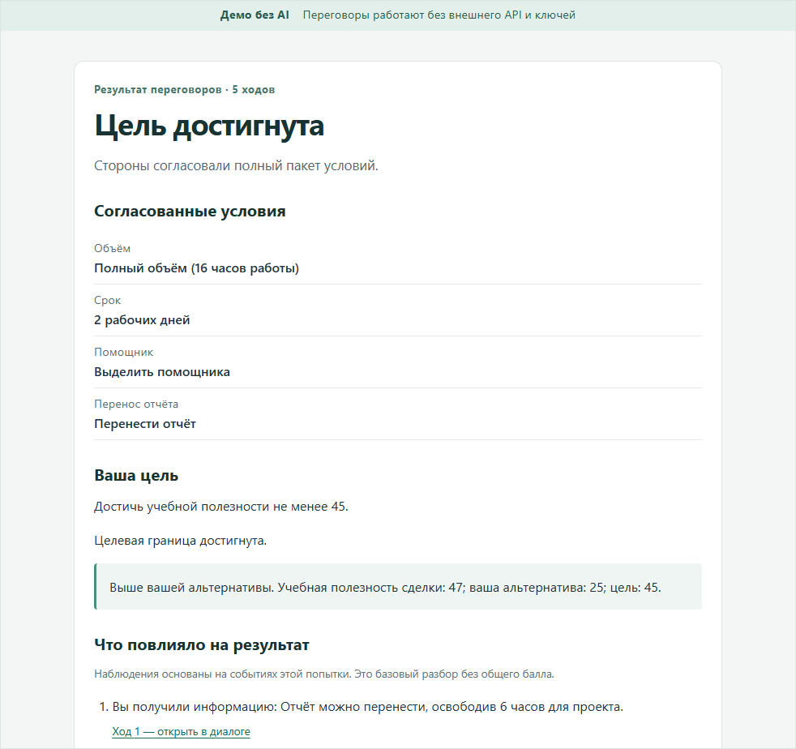

# TalkNFace — «Арена переговоров»

**Отрепетируйте сложный разговор до реальной встречи.**

Команда **«Ходоки»**. Капитан — Бастанов Айрат Иршатович; участник — Садыков Булат Фаридович. Место учёбы — КФУ.

Тренажёр для начинающего закупщика и руководителя: администратор настраивает ситуацию, игрок выбирает ходы, видит последствия и повторяет ту же версию иначе. Семьи сценариев: S1 «Поставка» и S2 «Срочная задача и нагрузка».

Игрок выбирает готовые действия; результат считает учебный движок. Свободный текстовый диалог и ИИ-оппонент в эту версию не входят.



**Для организаторов: [как развернуть и запустить](docs/ORGANIZER_LAUNCH_RU.md).**

| | |
| --- | --- |
| Запуск | [docs/ORGANIZER_LAUNCH_RU.md](docs/ORGANIZER_LAUNCH_RU.md) |
| Показ 3–5 мин | [docs/DEMO_GUIDE_RU.md](docs/DEMO_GUIDE_RU.md) |
| Презентация | [PPTX](docs/submission/TALKNFACE_PRODUCT_PITCH_RU.pptx) · [PDF](docs/submission/TALKNFACE_PRODUCT_PITCH_RU.pdf) |
| Документация | [docs/submission/README.md](docs/submission/README.md) |
| Обзор продукта | [docs/submission/PRODUCT_OVERVIEW_RU.md](docs/submission/PRODUCT_OVERVIEW_RU.md) |

## Запустить на Windows

Кратко те же три шага, что в [инструкции для организаторов](docs/ORGANIZER_LAUNCH_RU.md).

Нужны **Windows 10/11 x64**, PowerShell и Chrome. Для первого Prepare — сеть к **nodejs.org**, **registry.npmjs.org** и **github.com**. Python, CUDA, Docker, ключи AI и права администратора Windows не нужны.

```powershell
git clone --single-branch --branch docs/organizer-presentation-01 https://github.com/AiratBastanov/TalkNFace.git "TalkNFace"
Set-Location "TalkNFace"
powershell -NoProfile -ExecutionPolicy Bypass -File .\scripts\windows-demo.ps1 -Prepare
powershell -NoProfile -ExecutionPolicy Bypass -File .\scripts\windows-demo.ps1 -Start -Port 3100
```

При Prepare дважды введите свой пароль администратора (12–256 символов). Общего пароля в репозитории нет.

Откройте **http://127.0.0.1:3100/admin**. Игрок: **http://127.0.0.1:3100/**. Используйте `127.0.0.1`, не `localhost`.

Остановка — **отдельной** командой:

```powershell
powershell -NoProfile -ExecutionPolicy Bypass -File .\scripts\windows-demo.ps1 -Stop
```

Сценарий показа: [docs/DEMO_GUIDE_RU.md](docs/DEMO_GUIDE_RU.md).

## Runtime и воспроизводимость

Windows launcher принимает **ровно Node.js 24.21.0 x64 и npm 11.19.0**. Подходящая установка из текущего PATH используется автоматически; другой Node не принимается. Иначе Prepare скачивает [официальный portable ZIP](https://nodejs.org/download/release/v24.21.0/node-v24.21.0-win-x64.zip), сверяет SHA256 с [официальными SHASUMS](https://nodejs.org/download/release/v24.21.0/SHASUMS256.txt) и закреплённым `158f7685b44de51f6c0df1d153526cbcd3e1bc739a8dfc607721cef75de9e541`, проверяет пути/типы записей и распаковывает в `.tools/arena-runtime/`. При повторном использовании файлы runtime сверяются с этим ZIP. MSI, системные настройки, постоянный PATH, execution policy и права доступа Windows не меняются. `-ExecutionPolicy Bypass` относится только к указанному процессу PowerShell.

Можно явно передать `-NodePath 'C:\portable\node.exe'` к каждой команде. Требуется тот же bundled npm. Общий developer runtime-check допускает `>=24.0.0 <25`; **сертифицируемый Windows launcher намеренно строже**.

Установка: `npm ci --ignore-scripts --include=dev --no-audit --no-fund`, затем только закреплённый `prebuild-install` для `better-sqlite3@12.11.1`. Это исключает fallback на Python/node-gyp. Других Windows install hooks в текущем lockfile нет; изменение списка требует проверки. Затем проверяются `npm ls --all`, версии по lockfile, загрузка native SQLite, неизменность исходников/lockfile и выполняется `npm run build`. Кеш создаётся в `.tools/arena-npm-cache`, глобальные настройки npm не нужны. Первичная online-установка проверяется с пустым кешем; offline-установка с неполным кешем не обещается. После подготовки запуск/игра работают без внешних сервисов.

Лимиты: суммарная загрузка Node 300 с, проверка/распаковка 120 с, npm ci + native prebuilt 300 с, build 300 с, startup 20 с, backup/restore 60 с. Интерактивный ввод не ограничен этим таймером. Измерения свежего checkout — в [receipt воспроизводимости](docs/gates/APP_CLEAN_MACHINE_REPRODUCIBILITY_01.md); общая длительность Prepare включает ввод пароля, скорость зависит от сети/ПК.

## Данные, пароль, backup

Все локальные артефакты внутри checkout игнорируются Git:

| Путь | Назначение |
| --- | --- |
| `.local/arena-demo/arena.sqlite` и WAL/SHM | Публикации, общий черновик, попытки, ходы, подготовка, replay и G8 access records |
| `.local/arena-demo/backups/` | Проверенные SQLite backups |
| `.local/arena-demo/server.json`, `prepared.json`, `server.log` | Несекретное управление процессом, fingerprints сборки, безопасный лог |
| `.local/arena-config/admin.json` | Секретная локальная конфигурация с хешем пароля |
| `.tools/arena-runtime/`, `.tools/arena-npm-cache/` | Portable runtime и кеш установки |

Схема config: `{"schema":1,"adminPasswordHash":"<сгенерированный scrypt-хеш>"}`. Формат хеша — существующий G8 `scrypt$32768$8$1$<salt-hex>$<digest-hex>`. Скрипт создаёт его сам, не печатает и не заменяет при обычной подготовке. `.env`, `ADMIN_PASSWORD_HASH`, `HOST`, `DATABASE_PATH` и внешние deployment overrides этим launcher не используются: источник настроек один. Не отправляйте `.local`/backups в Git или публичные материалы.

Явная смена пароля при остановленном сервере:

```powershell
powershell -NoProfile -ExecutionPolicy Bypass -File .\scripts\windows-demo.ps1 -Stop
powershell -NoProfile -ExecutionPolicy Bypass -File .\scripts\windows-demo.ps1 -SetAdminPassword
```

Смена хеша делает прежние admin-сессии недействительными. Отсутствующий/повреждённый config запрещает Start; Prepare не перезаписывает повреждённый config. Только для автоматизации есть `-PasswordFromStdin`: пароль передаётся UTF-8 через stdin из памяти/секретного хранилища, никогда через аргумент или литерал в истории команд. Обычный пользователь использует скрытый prompt.

Backup работает и при запущенном демо. Используется [SQLite backup API better-sqlite3](https://github.com/WiseLibs/better-sqlite3/blob/master/docs/api.md#backupdestination-options---promise), затем `integrity_check`/`foreign_key_check`, а не копирование открытого файла:

```powershell
powershell -NoProfile -ExecutionPolicy Bypass -File .\scripts\windows-demo.ps1 -Backup
powershell -NoProfile -ExecutionPolicy Bypass -File .\scripts\windows-demo.ps1 -Status
powershell -NoProfile -ExecutionPolicy Bypass -File .\scripts\windows-demo.ps1 -Stop
powershell -NoProfile -ExecutionPolicy Bypass -File .\scripts\windows-demo.ps1 -Restore 'ID-из-Backup-или-Status'
```

Restore принимает только ID своего backup, проверяет его и сохраняет прежнюю БД в `before-restore-*`. Закройте сторонние SQLite-редакторы. Публикации/попытки возвращаются к снимку. Чтобы restore не оживлял отозванный доступ, сессии снимка сохраняют доступ только если они ещё действуют в текущей БД, без продления срока; отсутствующие/отозванные сессии отзываются и в восстановленной БД. Текущие отметки активности и лимит попыток входа также не откатываются назад (после restore лимит может быть консервативнее). Backups не заменяют config/пароль.

**Явный сброс демо** при остановленном сервере:

```powershell
powershell -NoProfile -ExecutionPolicy Bypass -File .\scripts\windows-demo.ps1 -ResetDemoData
```

Команда показывает точный путь, сохраняет `before-reset-*` backup и создаёт пустую БД через SQLite. Пароль и backups остаются. Symlink/junction и выход за локальный каталог запрещены. Сброс никогда не выполняется автоматически. После сброса начните новую игру; прежние cookie не дают доступа к удалённым попыткам.

## Если запуск не удался

- Нет сети: разрешите перечисленные HTTPS-источники и повторите Prepare. При недоступном native prebuilt установка останавливается, не запускает Python. БД/config не удаляются.
- Неподходящий NodePath: укажите точные Node/npm или уберите параметр для автоматической загрузки.
- Повреждённый/неполный runtime: переместите **только `.tools/arena-runtime`** в другой локальный каталог, повторите Prepare. `.local` сохраняйте.
- Ошибка npm ci/несовпадающий lockfile: используйте согласованный checkout; не применяйте npm install/audit-fix как способ починки этого пути.
- Прерванный Prepare/build: повторите Prepare. Start проверяет fingerprints и не использует частичную сборку.
- Порт занят: остановите занимающую его программу самостоятельно или задайте другой Port; launcher не убивает чужие процессы.
- БД заблокирована/недоступна: закройте SQLite-редактор/другой экземпляр, проверьте доступность каталога. Не удаляйте БД/WAL для восстановления.
- Неясное состояние: Status, затем Verify; startup log — `.local/arena-demo/server.log`, справка — Help.

## Архитектура и границы

Один production Fastify-процесс обслуживает React/Vite и API с одного origin. SQLite/better-sqlite3 хранит данные; миграции 1–5 применяются без сброса. Пять явных workspaces: `apps/server`, `apps/web`, `packages/contracts`, `packages/domain`, `packages/scenarios`. `packages/ai` вне installation/runtime; обучающие данные и модели не нужны. Контекст детерминированно компилируется из шести настроек, проверяется движком и публикуется отдельной неизменяемой версией. Разбор G6 выводится из сохранённых событий/фраз; replay — отдельная попытка той же версии.

G8: HttpOnly/SameSite=Strict cookie, владение попытками, CSRF, Origin/Fetch Metadata, rotation/logout/expiry. UUID — адрес, не авторизация. Player access: 24ч idle/7д absolute; admin: 30мин idle/8ч absolute. GET не продлевает доступ. Потеря cookie/выход/истечение срока не имеют восстановления аккаунта; данные остаются в БД. Перезапуск с прежним хешем сохраняет действующий доступ. Общий лимит входа — 10 попыток за 15мин, включая успешные. trustProxy не включается.

Этот путь — **loopback HTTP на локальном ПК**. Публичный сайт, HTTPS и Linux/macOS в эту поставку не входят.

Обучение модели и каталоги `ml/`, `tools/windows-rtx*`, `evals/` к запуску тренажёра не относятся. Их не нужно выполнять, чтобы показать продукт.
